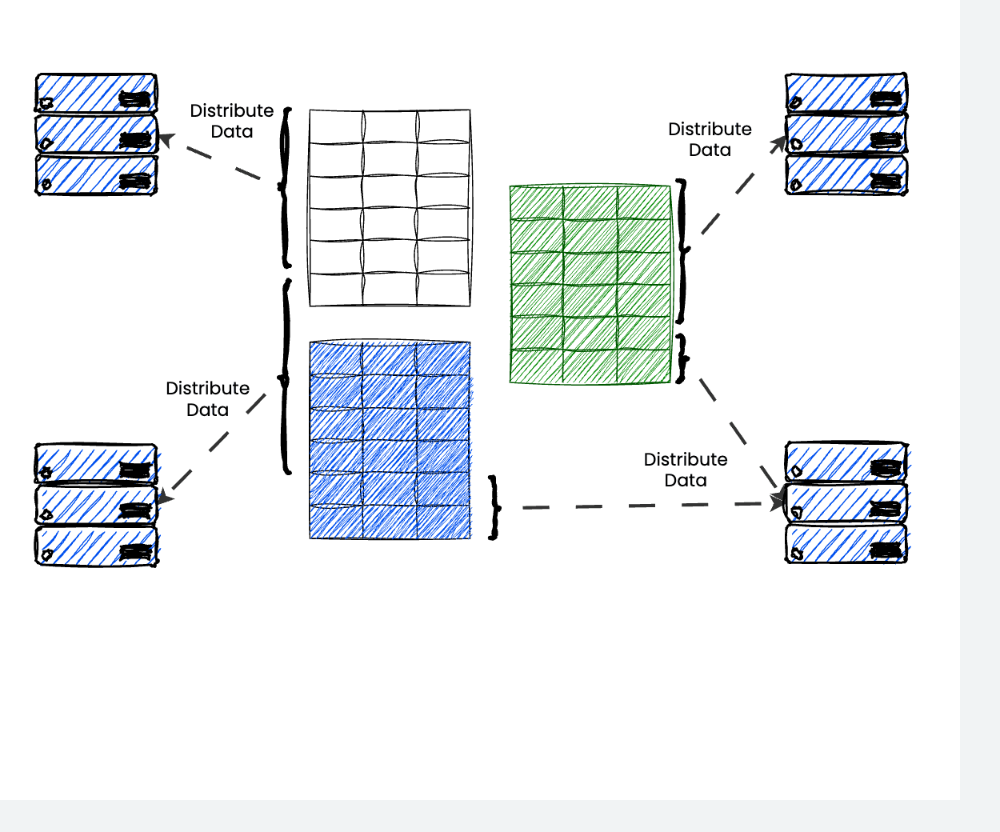

# 🎬 Draw.io to GIF Converter

[](https://opensource.org/licenses/MIT)
[](https://nodejs.org)

A dual-interface application that converts [draw.io](https://draw.io) / [diagrams.net](https://diagrams.net) diagram files into animated GIF images by recording the diagram loading and rendering process.

**Two ways to use it:**

- 💻 **Command-Line Tool** - Direct file conversion for automation and scripting
- 🌐 **Web Application** - Modern Next.js UI with drag-and-drop file upload, real-time preview, and adjustable settings

Perfect for creating animated documentation, tutorials, presentations, or sharing your diagrams on platforms that support GIF animations!

https://github.com/user-attachments/assets/a32ea65d-fbae-4af9-aedd-68b3861e573e

## ✨ Features

- 🎥 **Animated GIF Creation** - Records the diagram loading process over time
- ⚙️ **Fully Customizable** - Control recording duration (1-60s) and frame rate (1-30 fps)
- 🖼️ **High Quality Output** - Produces proper multi-frame animated GIF files
- 🎯 **Clean Export** - No UI elements, just your diagram
- 🚀 **Headless Rendering** - Uses Puppeteer for accurate browser-based rendering
- 📦 **Multiple Formats** - Supports `.drawio`, `.dio`, and `.xml` files
- 📄 **Multi-Page Support** - Export specific pages or all pages from multi-page diagrams
- 🗜️ **Batch Export** - Export all pages as a convenient ZIP archive (Web UI)
- 🛡️ **Error Handling** - Comprehensive error handling for reliable operation
- 💻 **CLI Available** - Command-line interface for automation and scripting
- 🔄 **Dual Interface** - Use the web app or CLI tool - same conversion engine

## 📋 Requirements

- **Node.js** 18.17.0 or higher (required by Sharp)
- **npm** (comes with Node.js)

## 🚀 Quick Start

### Installation

```bash
# Clone the repository
git clone https://github.com/ngxba/drawio-gif-creator.git
cd drawio-gif-creator

# Install dependencies
npm install
```

### Option 1: Command-Line Interface

```bash
# Try with the included sample diagram
node src/index.js samples/sample.drawio output.gif

# Convert your own diagram with default settings (5 seconds at 10 fps)
node src/index.js your-diagram.drawio output.gif

# Custom duration and frame rate
node src/index.js your-diagram.drawio output.gif 10 15
```

### Option 2: Web Application

```bash
# Start the development server
npm run dev

# Open http://localhost:3000 in your browser
```

> 💡 **Tip**: A `sample.drawio` file is included in the `/samples` directory so you can test the tool immediately!

## 📖 Usage Guide

### Command-Line Usage

#### Command Syntax

```bash
node src/index.js <input-file> <output-file> [duration] [fps] [page|--all]
```

#### Parameters

| Parameter     | Description                       | Required | Default | Range                     |
| ------------- | --------------------------------- | -------- | ------- | ------------------------- |
| `input-file`  | Path to your draw.io diagram file | ✅ Yes   | -       | `.drawio`, `.dio`, `.xml` |
| `output-file` | Path for the output GIF file      | ✅ Yes   | -       | `.gif`                    |
| `duration`    | Recording duration in seconds     | ❌ No    | 5       | 1-60                      |
| `fps`         | Frames per second                 | ❌ No    | 10      | 1-30                      |
| `page`        | Page index to export (0-based)    | ❌ No    | 0       | 0 to page count - 1       |
| `--all`       | Export all pages                  | ❌ No    | -       | Creates multiple files    |

#### CLI Examples

```bash
# Quick 5-second animation at 10 fps (50 frames)
node src/index.js diagram.drawio output.gif

# Longer 10-second animation at 15 fps (150 frames)
node src/index.js diagram.drawio output.gif 10 15

# Short and compact: 3 seconds at 8 fps (24 frames)
node src/index.js diagram.drawio output.gif 3 8

# High frame rate for smooth animation: 5 seconds at 20 fps (100 frames)
node src/index.js diagram.drawio output.gif 5 20
```

#### Global CLI Installation

Install globally to use from anywhere on your system:

```bash
npm link
drawio-to-gif diagram.drawio output.gif 5 10
```

### Web Application Usage

1. Start the development server: `npm run dev`
2. Open [http://localhost:3000](http://localhost:3000) in your browser
3. Upload your draw.io file (drag-and-drop or click to browse)
4. Adjust duration (1-60 seconds) and FPS (1-30) using the sliders
5. Click "Convert to GIF" and watch the progress
6. Preview and download your animated GIF

### Multi-Page Diagram Support

Both the CLI and web application now support draw.io files with multiple pages!

#### CLI Multi-Page Commands

```bash
# List all pages in a diagram
node src/index.js --list-pages diagram.drawio

# Export a specific page (0-based index)
node src/index.js diagram.drawio output.gif 5 10 1

# Export all pages (creates multiple files)
node src/index.js diagram.drawio output.gif 5 10 --all
```

**Output for `--all` flag:**

- `output-page0.gif` - First page
- `output-page1.gif` - Second page
- `output-page2.gif` - Third page
- etc.

#### Web UI Multi-Page Support

When you upload a multi-page draw.io file to the web application:

1. **Page Selector** - A dropdown appears showing all available pages
2. **Export All Checkbox** - Check to export all pages at once
3. **ZIP Download** - When exporting all pages, you'll receive a ZIP file containing individual GIF files for each page

**Features:**

- 📄 Automatic page detection
- 🎯 Select specific pages to export
- 📦 Export all pages as a ZIP archive
- 🏷️ Page names preserved in output filenames

**Example:**

```
Diagram with pages: "Architecture", "Flow", "Database"

Export All creates: diagram-all.zip containing:
  ├── Architecture-page0.gif
  ├── Flow-page1.gif
  └── Database-page2.gif
```

## 🎨 Output Examples

### Example Result

Here's an example of what you can create with this tool:



_Generated from the included `samples/sample.drawio` file_

The application produces animated GIFs that loop continuously:

- **Small**: 3 seconds @ 8 fps ≈ 1-2 MB (24 frames)
- **Medium**: 5 seconds @ 10 fps ≈ 2-5 MB (50 frames)
- **Large**: 10 seconds @ 15 fps ≈ 5-15 MB (150 frames)

### What Gets Captured

- ✅ The complete diagram as it loads
- ✅ Any animations or transitions in the viewer
- ✅ Proper dimensions matching your diagram
- ✅ Clean rendering without draw.io UI elements
- ✅ Padding around the diagram for better presentation

### Try It Yourself

A sample draw.io file is included in the `/samples` directory. You can test the tool immediately after installation:

```bash
# Using the included sample file
node src/index.js samples/sample.drawio my-output.gif

# Or with custom settings
node src/index.js samples/sample.drawio my-output.gif 5 15
```

## 📊 Performance & Optimization

### File Size Calculation

**Frame count** = duration × fps

Example: 5 seconds at 10 fps = **50 frames**

**File size** ≈ 50-100 KB per frame (varies with diagram complexity)

### Optimization Tips

| Goal                 | Recommended Settings | Output                 |
| -------------------- | -------------------- | ---------------------- |
| **Smallest file**    | 3s @ 5fps            | ~15 frames, 0.7-1.5 MB |
| **Balanced**         | 5s @ 10fps           | ~50 frames, 2-5 MB     |
| **Smooth animation** | 5s @ 20fps           | ~100 frames, 4-10 MB   |
| **Best quality**     | 10s @ 25fps          | ~250 frames, 10-25 MB  |

**Processing time**: Approximately 1-2 seconds per second of recording

### Tips

- 📉 **Lower FPS** (5-10) = Smaller files, faster processing
- 🎞️ **Higher FPS** (15-30) = Smoother animation, larger files
- ⏱️ **Shorter duration** (3-5s) = Quick conversion, compact output
- 🎬 **Longer duration** (8-10s) = Captures more of the loading process

## 🏗️ Project Structure

```
drawio-gif-creator/
├── app/                    # Next.js web application
│   ├── page.tsx           # Main page
│   ├── layout.tsx         # Root layout
│   └── api/
│       ├── convert/       # Conversion API endpoint
│       └── list-pages/    # Page listing API endpoint
├── components/            # React UI components
│   ├── converter-form.tsx # Main form orchestrator
│   ├── file-upload-card.tsx
│   ├── conversion-settings-card.tsx
│   ├── conversion-progress.tsx
│   ├── preview-card.tsx
│   └── ui/               # UI components
│       ├── select.tsx    # Page selector dropdown
│       ├── checkbox.tsx  # Export all checkbox
│       └── ...           # Other Radix UI components
├── lib/                  # Shared utilities
│   ├── converter.ts      # Web wrapper for CLI
│   ├── page-lister.ts    # Page detection utility
│   └── utils.ts          # Utility functions
├── src/                  # CLI conversion engine
│   ├── index.js          # CLI entry point
│   ├── converter.js      # Core conversion logic
│   ├── fileReader.js     # File reading and page detection
│   ├── renderer.js       # Puppeteer frame capture
│   └── imageConverter.js # GIF encoding
├── samples/              # Sample diagrams and test data
│   ├── sample.drawio     # Sample diagram file (multi-page)
│   ├── multi-page-sample.drawio  # Multi-page example
│   └── result.gif        # Example output
└── README.md             # This file
```

## 🔧 How It Works

Both the web app and CLI tool use the same conversion engine:

1. **📖 File Reading** - Reads and validates the draw.io XML file
2. **🌐 Browser Launch** - Starts headless Chrome via Puppeteer
3. **🎨 Diagram Loading** - Loads diagram in the diagrams.net viewer
4. **📸 Frame Capture** - Takes screenshots at specified intervals
5. **🎞️ GIF Encoding** - Converts PNG frames to animated GIF
6. **💾 File Output** - Saves the final GIF (to disk for CLI, as download for web)

## 📦 Dependencies

### Core Conversion Engine

- **[puppeteer](https://github.com/puppeteer/puppeteer)** (^24.0.0) - Headless Chrome automation
- **[sharp](https://github.com/lovell/sharp)** (^0.33.0) - High-performance image processing
- **[gif-encoder-2](https://github.com/benjaminadk/gif-encoder-2)** (^1.0.5) - Pure JavaScript GIF encoder
- **[archiver](https://github.com/archiverjs/node-archiver)** (^7.0.1) - ZIP file creation for multi-page exports

### Web Application

- **[next](https://nextjs.org/)** (^15.5.4) - React framework with App Router
- **[react](https://react.dev/)** (^19.2.0) - UI library
- **[@radix-ui](https://www.radix-ui.com/)** - Headless UI components
- **[tailwindcss](https://tailwindcss.com/)** (^4.1.14) - Utility-first CSS framework
- **[lucide-react](https://lucide.dev/)** (^0.545.0) - Icon library

## 🐛 Troubleshooting

### Common Issues

**"File not found" error**

- Verify the input file path is correct
- Ensure the file has a `.drawio`, `.dio`, or `.xml` extension

**"Rendering timeout" error**

- Check your internet connection (required to access diagrams.net viewer)
- Try increasing the duration parameter
- Ensure the draw.io file is valid

**Large file sizes**

- Reduce FPS (e.g., from 15 to 8)
- Shorten duration (e.g., from 10s to 5s)
- Simplify your diagram if possible

**Out of memory errors**

- Reduce the total frame count (duration × fps)
- Process smaller diagrams
- Increase Node.js memory: `node --max-old-space-size=4096 src/index.js ...`

## ⚠️ Limitations

- Requires internet connection to access the diagrams.net viewer
- Maximum duration: 60 seconds
- Maximum FPS: 30
- Processing time scales with duration and frame rate
- Large/complex diagrams produce larger GIF files

## 🤝 Contributing

Contributions are welcome! Please feel free to submit a Pull Request. For major changes:

1. Fork the repository
2. Create your feature branch (`git checkout -b feature/AmazingFeature`)
3. Commit your changes (`git commit -m 'Add some AmazingFeature'`)
4. Push to the branch (`git push origin feature/AmazingFeature`)
5. Open a Pull Request

## 📝 License

This project is licensed under the MIT License - see below for details:

```
MIT License

Copyright (c) 2024 Draw.io GIF Creator

Permission is hereby granted, free of charge, to any person obtaining a copy
of this software and associated documentation files (the "Software"), to deal
in the Software without restriction, including without limitation the rights
to use, copy, modify, merge, publish, distribute, sublicense, and/or sell
copies of the Software, and to permit persons to whom the Software is
furnished to do so, subject to the following conditions:

The above copyright notice and this permission notice shall be included in all
copies or substantial portions of the Software.

THE SOFTWARE IS PROVIDED "AS IS", WITHOUT WARRANTY OF ANY KIND, EXPRESS OR
IMPLIED, INCLUDING BUT NOT LIMITED TO THE WARRANTIES OF MERCHANTABILITY,
FITNESS FOR A PARTICULAR PURPOSE AND NONINFRINGEMENT. IN NO EVENT SHALL THE
AUTHORS OR COPYRIGHT HOLDERS BE LIABLE FOR ANY CLAIM, DAMAGES OR OTHER
LIABILITY, WHETHER IN AN ACTION OF CONTRACT, TORT OR OTHERWISE, ARISING FROM,
OUT OF OR IN CONNECTION WITH THE SOFTWARE OR THE USE OR OTHER DEALINGS IN THE
SOFTWARE.
```

## 🌟 Show Your Support

If you find this project useful, please consider:

- ⭐ Starring the repository
- 🐛 Reporting bugs or requesting features via [Issues](https://github.com/ngxba/drawio-gif-creator/issues)
- 🔀 Contributing improvements via Pull Requests
- 📢 Sharing with others who might find it useful

## 📧 Contact & Support

- **Issues**: [GitHub Issues](https://github.com/ngxba/drawio-gif-creator/issues)
- **Discussions**: [GitHub Discussions](https://github.com/ngxba/drawio-gif-creator/discussions)

---

Made with ❤️ for the draw.io/diagrams.net community
